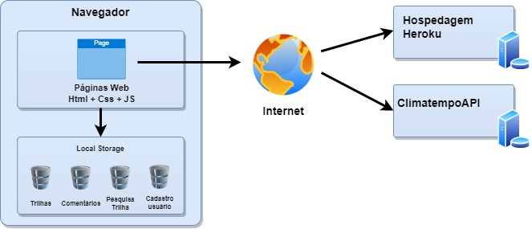

# Arquitetura da Solução

Pré-requisitos: <a href="04-Projeto de Interface.md"> Projeto de Interface</a>

Definição de como o software é estruturado em termos dos componentes que fazem parte da solução e do ambiente de hospedagem da aplicação.

## Diagrama de componentes

Diagrama que permite a modelagem física de um sistema, através da visão dos seus componentes e relacionamentos entre os mesmos. Os componentes que fazem parte da solução são apresentados na Figura abaixo.

Arquitetura da Solução

 

A solução implementada conta com os seguintes módulos:

* **Navegador**: Interface básica do sistema
  * **Páginas Web** - Conjunto de arquivos HTML, CSS, JavaScript e imagens que implementam as funcionalidades do sistema.
  * **Local Storage** - armazenamento mantido no Navegador, onde são implementados bancos de dados baseados em JSON. São eles:
    * **Trilhas** - seções de trilhas cadastradas no sistema
    * **Comentários** - registro de opiniões dos usuários sobre as trilhas apresentadas no sistema
    * **Pesquisa de Trilha** - lista de trilhas segundo filtro de busca do usuário
    * **Cadastro do Usuário** - Informações do usuário cadastrado no sistema
* **Hospedagem** - local na Internet onde as páginas são mantidas e acessadas pelo navegador
* **Climatempo API** - plataforma que permite o acesso a informações da previsão do tempo.

## Tecnologias Utilizadas

No projeto da Easy Trail, será utilizada tecnologias de ponto, no desenvolvimento do front end, será utilizado Java Script e HTML para confecção do código do software. A equipe de desenvolvimento usará o Microsoft Visual Studio para a confecção do código da solução e o github como repositório oficial para arquivo e controle de configuração e mudanças ocorridas no projeto durante a sua execução.
