# Programação de Funcionalidades

Pré-requisitos: <a href="02-Especificação do Projeto.md"> Especificação do Projeto</a>, <a href="04-Projeto de Interface.md"> Projeto de Interface</a>, <a href="03-Metodologia.md"> Metodologia</a>, <a href="05-Arquitetura da Solução.md"> Arquitetura da Solução</a>

Abaixo temos a descrição das funcionalidades criadas por cada integrante da equipe do projeto, com exposição dos códigos e das imagens do html implementado.

# Funcionalidades:

## 1- Carlos José
`Carrossel`

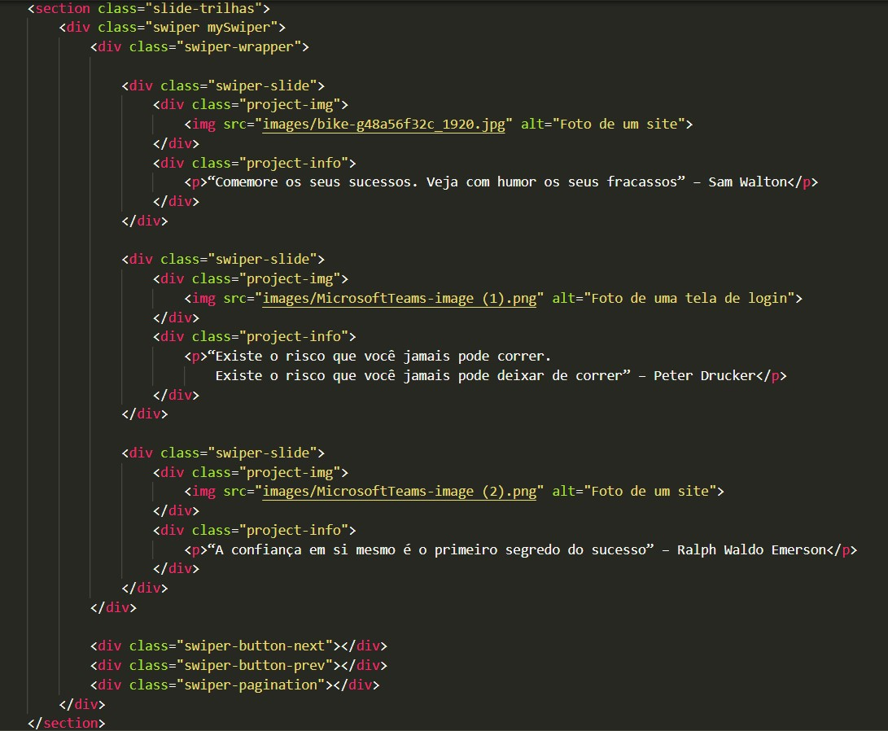
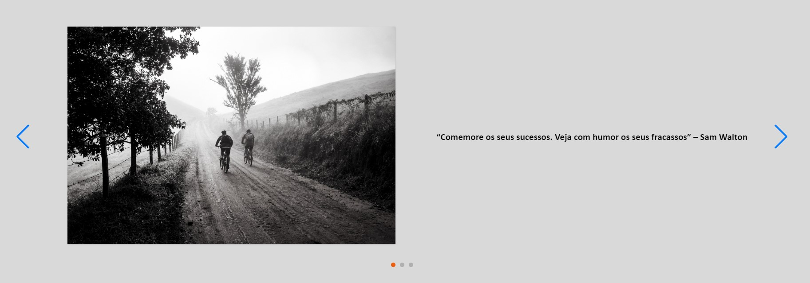

## 2- Leonardo Lima
`Filtro Pesquisa`

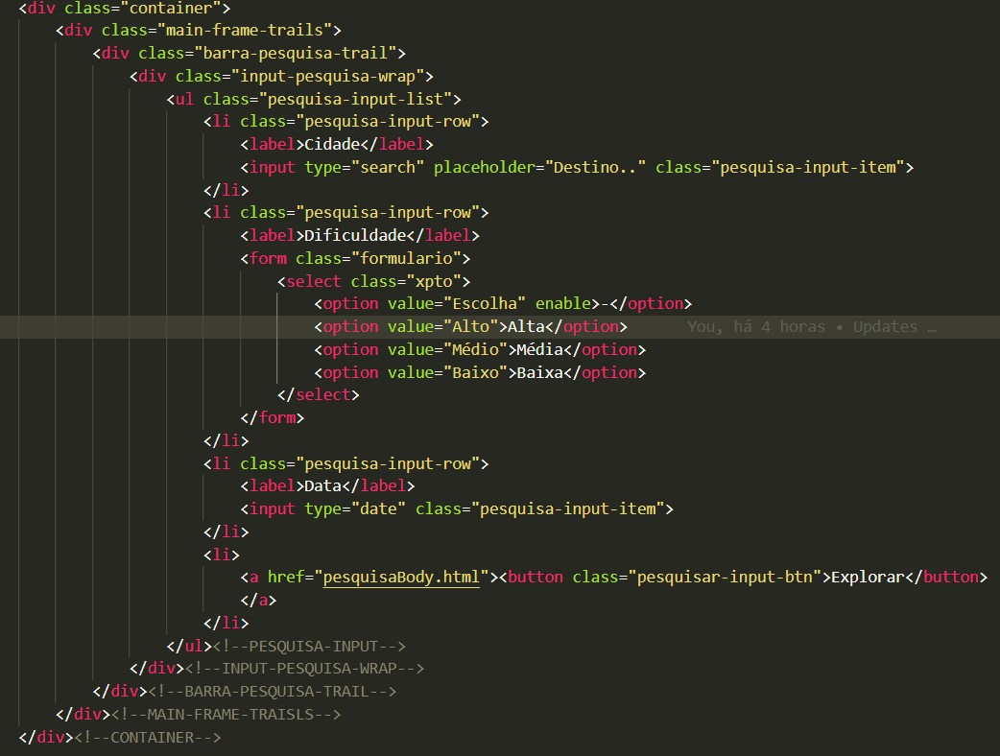
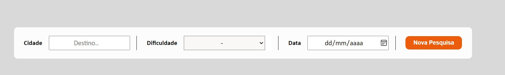

`Veja Mais`

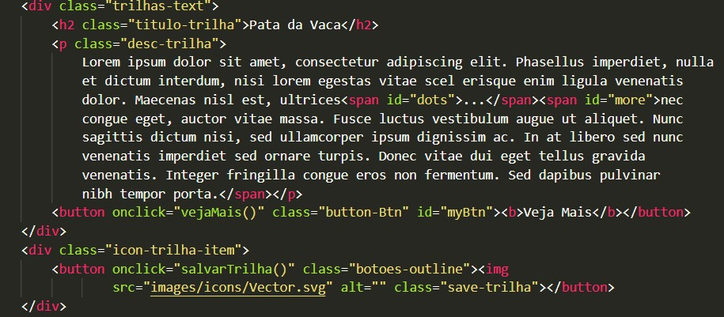
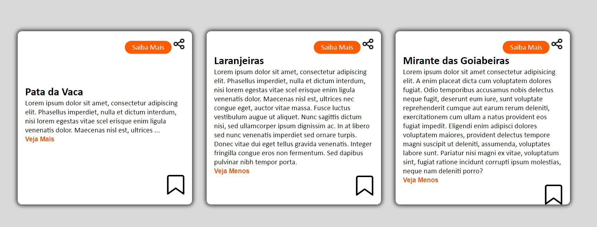

## 3- Leonardo Buck
`Botão Compartilhar`

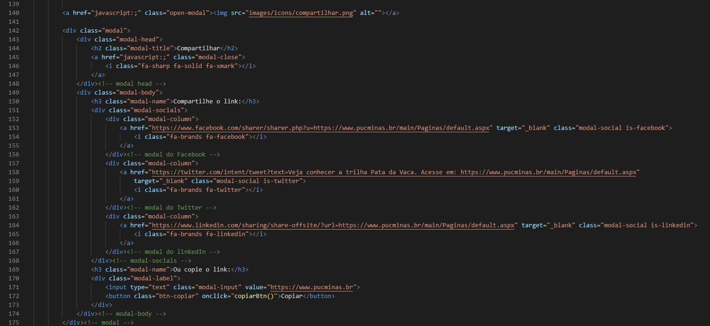
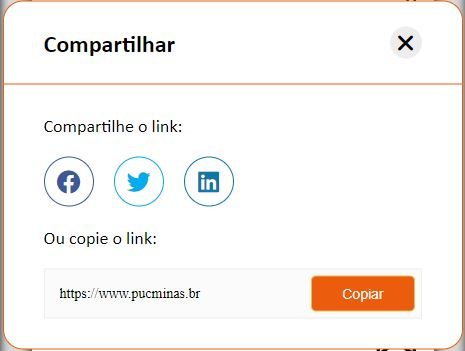

## 4- Rafael Santana
`Cadastro de Trilhas`

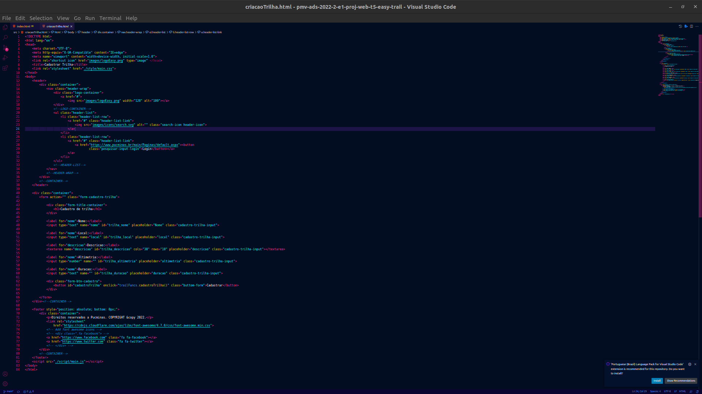
.png)
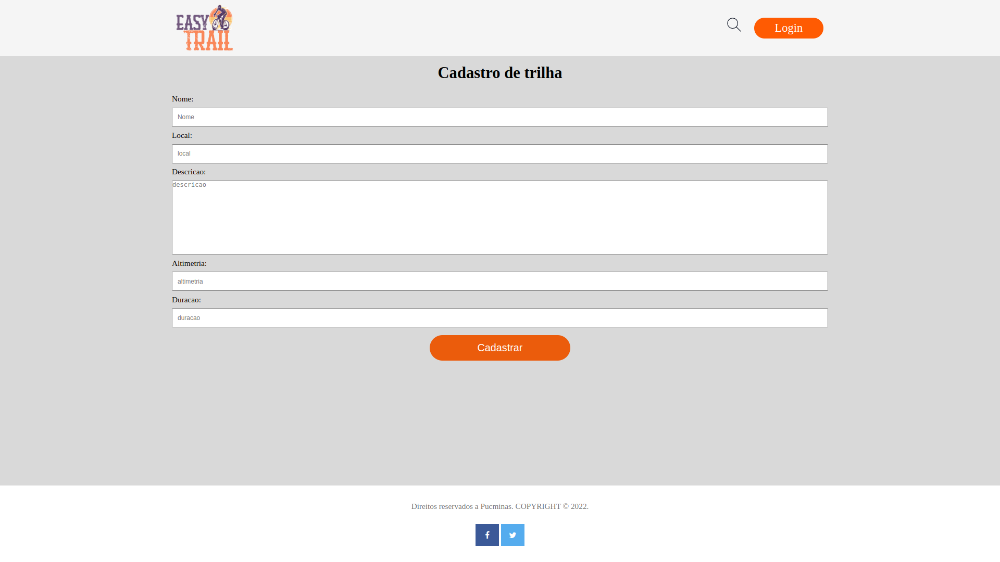

## 5- Diogo Silva
`Formulário`

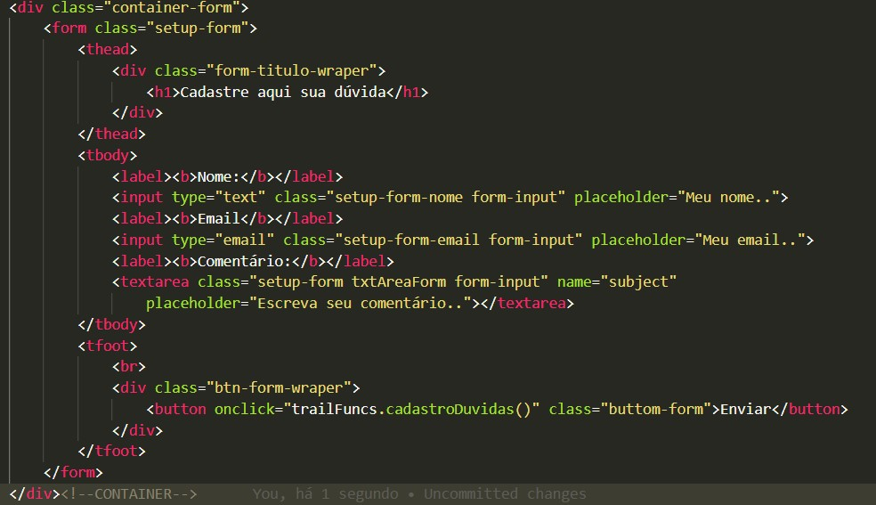
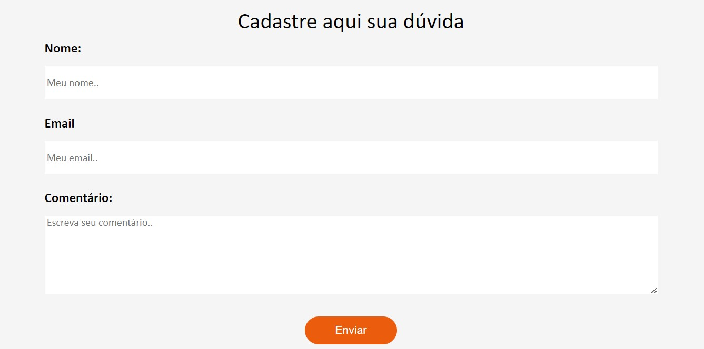
